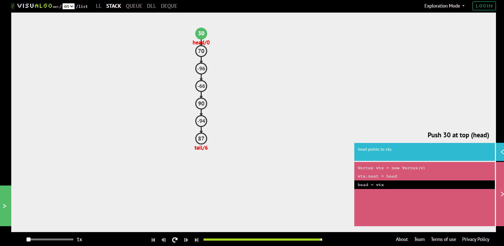
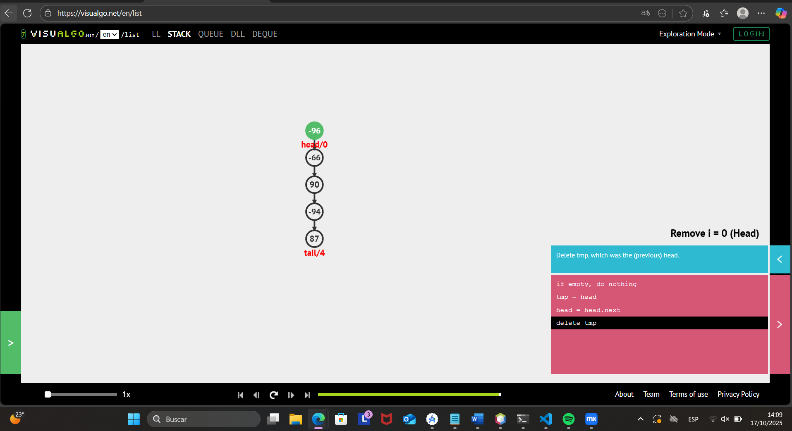
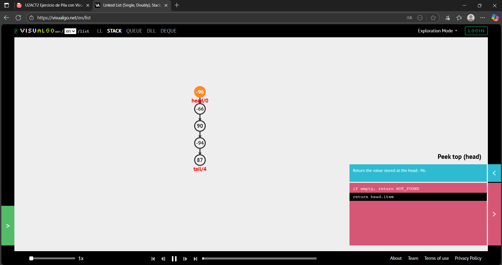
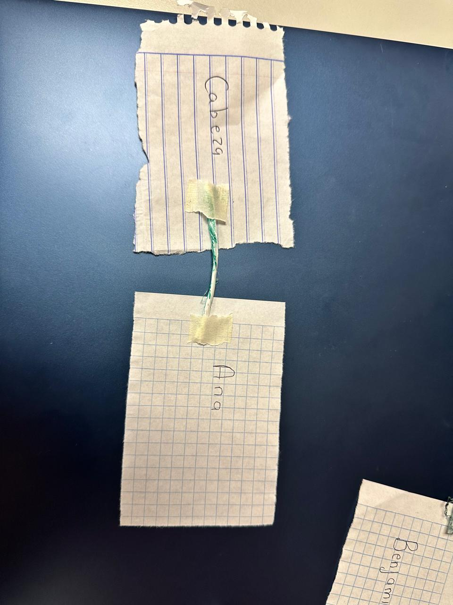
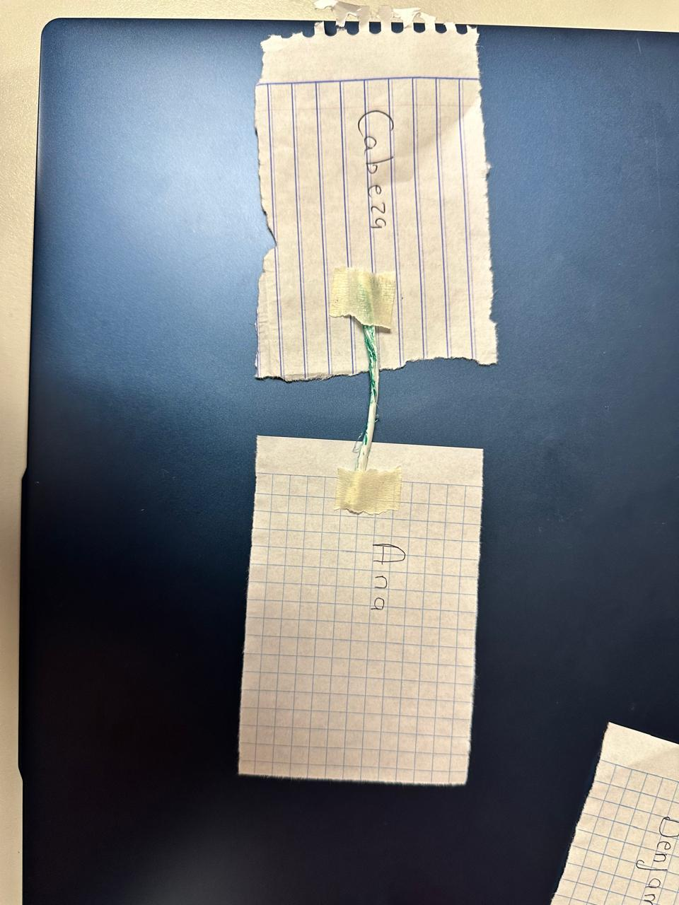
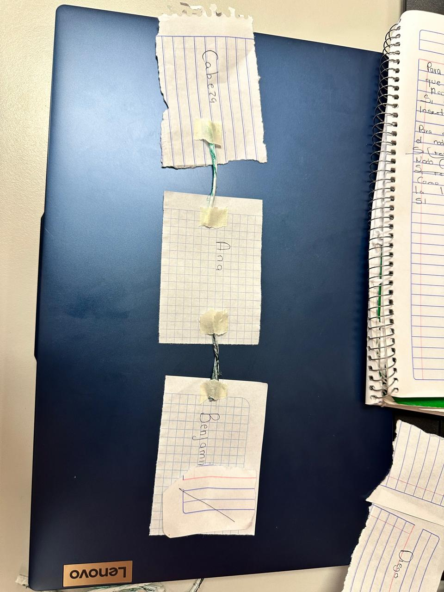
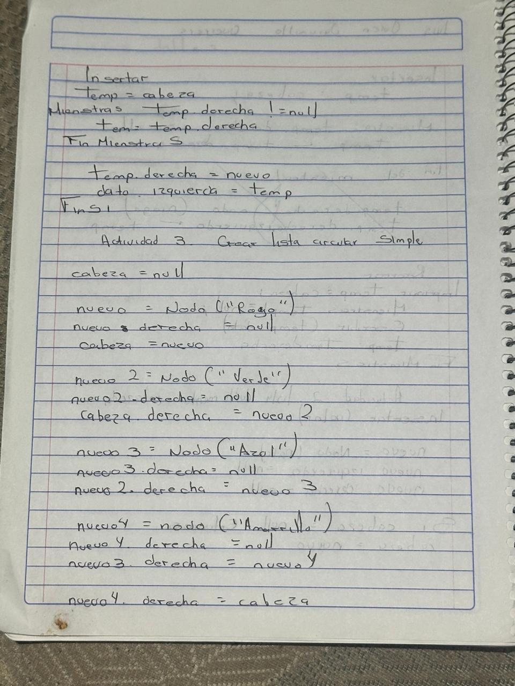

# 🧩 Ejercicios Guiados 2

Repositorio de actividades prácticas para reforzar conceptos de **Estructuras De Datos**, a través de ejercicios guiados.

---

## 🧙‍♂️ Dinámica: *La Lista Encantada – Versión Enlazada*
**Objetivo:** Comprender cómo funciona una **lista simplemente enlazada (`LinkedList`)** donde cada nodo conoce solo al siguiente.

Durante la actividad, representamos físicamente una lista: cada participante fue un nodo, enlazado al siguiente con tarjetas y flechas, mientras el “invocador” ejecutaba comandos como `.add()`, `.remove()` y `.traverse()`.

📸 *Evidencia:*
| Momento | Imagen |
|----------|--------|
| Representación de la lista |  |
| Ejecución del método `.remove()` |  |

---

## 🧱 Actividad: *Especificación e Implementación de la Pila (TAD Pila)*

**Objetivo:** Diseñar e implementar una **estructura de pila genérica** aplicando los principios de **POO y TAD**.

### 🧩 Etapas principales
- **Interfaz `Pila<E>`:** Define operaciones visibles (`push`, `pop`, `top`, `estaVacia`) usando genéricos.  
- **Clase `PilaArray<E>`:** Implementa la interfaz usando un arreglo privado y la variable `cima`.  
- **Encapsulamiento:** Se protege la estructura interna con `private`.  
- **Excepciones:** Se lanza una excepción al hacer `pop()` sobre una pila vacía.  

📸 *Evidencia:*
| Parte del ejercicio | Imagen |
|----------------------|--------|
| Código de la interfaz `Pila` | ) |
| Ejemplo de implementación | |

---

## ☕ Principios de POO aplicados
| Principio | Aplicación |
|------------|-------------|
| **Abstracción** | Separar el *qué* (interfaz) del *cómo* (implementación). |
| **Encapsulamiento** | Ocultar la estructura interna usando `private`. |
| **Polimorfismo** | Varias implementaciones (`PilaArray`, `PilaListaEnlazada`) pueden cumplir la misma interfaz. |

---
## 🧮 Actividad: *Manipulación de una Pila en Visualgo.net*

**Objetivo:** Comprender el comportamiento de una **pila (estructura LIFO: Last In, First Out)** mediante una simulación visual interactiva en [Visualgo.net](https://visualgo.net/en/list).

---

### 🧩 Descripción breve
En esta práctica se exploró el funcionamiento de una **pila dinámica**, observando cómo los nodos se apilan y desapilan visualmente al aplicar las operaciones principales del TAD:

- **Push:** Inserta un nuevo elemento en la cima.  
- **Pop:** Elimina el último elemento agregado.  
- **Peek:** Muestra el elemento superior sin eliminarlo.

📋 **Pasos realizados:**
1. Crear la pila con la opción **Create → User Defined List**.  
2. Insertar elementos (`70`, `30`) con **Push**.  
3. Eliminar elementos con **Pop | 1x**.  
4. Usar **Peek** para identificar el nodo en la cabeza.  

---

### 💭 Reflexión
- ¿Qué estructura se forma visualmente con los nodos?  
- ¿Qué sucede si se realiza *pop* en una pila vacía?  
- ¿Qué diferencia hay entre *push* y *pop*?  
- Ejemplos de uso: **historial de navegador, deshacer/rehacer, llamadas recursivas, pilas de platos, compiladores.**

---

📸 *Evidencia:*
| Acción | Imagen |
|--------|--------|
| Inserción con **Push** |  |
| Eliminación con **Pop** |  |
| Imprimir con **Peek** |  |

---

🧷 *Actividad guiada realizada en [Visualgo.net](https://visualgo.net/en/list) para reforzar el concepto de pila (LIFO) mediante simulación visual.*

---

## 🧩 Actividad 3 – Listas Enlazadas (Simples, Dobles y Circulares)

## 🧙‍♂️ Dinámica: La Lista Encantada – Lista Simplemente Enlazada

**Objetivo:** Visualizar cómo cada nodo apunta solo al siguiente nodo y cómo se modifican los enlaces al insertar o eliminar.

**Lista inicial:**

[Ana] → [Benjamín] → [Carla] → [Diego] → NULL

Procedimiento físico:

Escribir cada nombre en una tarjeta [DATO | →].

Unir con hilo rojo hacia el siguiente nodo.

Marcar el último con NULL.

Insertar el nodo Elena entre Carla y Diego.

Insertar el nodo Dalia al final de la lista.

Eliminar el nodo Benjamín.

Pseudocódigo:

Creación
Inicio
  CrearNodo(Ana)
  CrearNodo(Benjamín)
  CrearNodo(Carla)
  CrearNodo(Diego)
  Ana.sig = Benjamín
  Benjamín.sig = Carla
  Carla.sig = Diego
  Diego.sig = NULL
Fin

Inserción (Elena entre Carla y Diego)
  nuevo = CrearNodo(Elena)
  nuevo.sig = Carla.sig
  Carla.sig = nuevo

Eliminación (Benjamín)
  aux = Ana
  Mientras aux.sig ≠ NULL Hacer
    Si aux.sig.dato = "Benjamín" Entonces
      aux.sig = aux.sig.sig
      Romper
    FinSi
    aux = aux.sig
  FinMientras

## 📸 Evidencia:

| Momento                           | Descripción / Imagen               |
| --------------------------------- | ---------------------------------- |
| Representación física de la lista |               |
| Inserción de “Ana”                |                   |
| Inserción de “Benjamin”           |                  |
| Pseudocodigo                      |             |
| Pseudocódigo                      |  |
| Pseudocódigo                      |  |
| Pseudocódigo                      |  |

Esta actividad permite entender la relación entre nodos y cómo se afectan al insertar o eliminar elementos.

Facilita la traducción de la manipulación física de nodos a pseudocódigo y Java.

Se puede extender para listas dobles o circulares modificando los enlaces de los nodos.

📅 *Ejercicios desarrollados como parte del módulo de estructuras de datos en Java – Octubre 2025*  
👨‍💻 *Autor:* [Tu Nombre Aquí]
